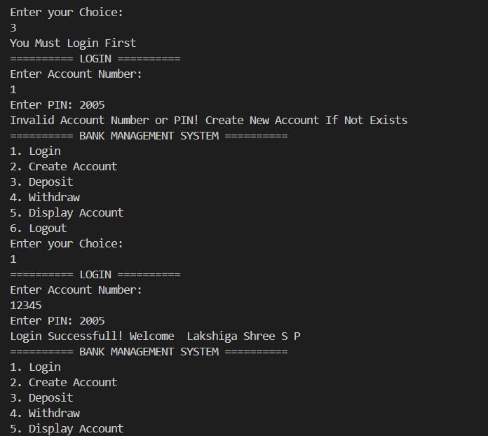
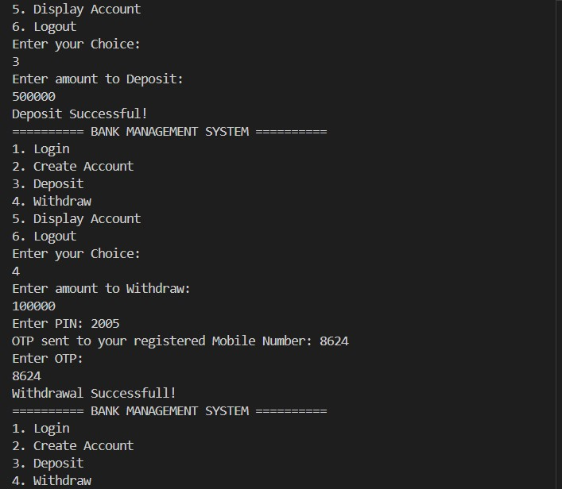
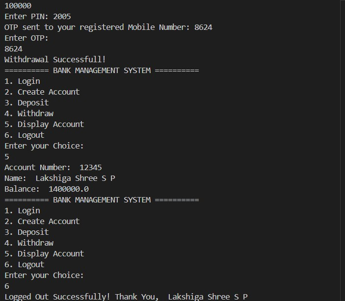

# Bank Management System(Java)

A **console-based Bank Management System** built in **Java** that simulates real-world banking operations.
Includes account creation, login/logout, deposit, withdrawal with PIN security, and OTP verification for large transactions.

---

## **Features**

- Create new bank account with account number, name, initial balance, and 4-digit PIN
- Secure login and logout functionality.
- Deposit and withdraw money
- OTP Verification for withdrawals above RS. 25,000.
- Display account details
- Console-based, beginner-friendly, OOP design

---

## **Tech Stack**

- Java(OOP, ArrayList, Scanner, Random)
- Console-based application (No GUI)
- Optional future: GUI with Java Swing or Web Application using React/Node.js

---

## **How to Run**

1. Make sure Java JDK is installed on your system.
2. Clone the repository:
   git clone https://github.com/Lakshigashree/bank-management-system.git
3. Navigate to the project directory:
   cd bank-management-system
4. Compile the program:
   javac BankManagementSystem.java
5. Run the program:
   java BankManagementSystem

   ***

## **Sample Output**

========== BANK MANAGEMENT SYSTEM ==========

1. Login
2. Create Account
3. Deposit
4. Withdraw
5. Display Account
6. Logout

Enter your Choice:
2

Enter Account Number:
12345

Enter Name:
Lakshiga Shree S P

Enter Initial Balance:
1000000

Set 4-digit PIN:
2005

Account Created Successfully!

---

## **Output Screenshots**

## **Future Implementations/Enhancements
- GUI version using Java Swing or JavaFX
- Web version using React(frontend) + Node.js/Java Spring Boot(Backend)
- Integration with databases(MySQL/PostgreSQL) for persistent storage
- Mobile app version using Flutter or React Native
- More security features(PIN hashing, email/mobile verification)
- Transaction history, admin panel, multi-user login, online money transfer simulation.